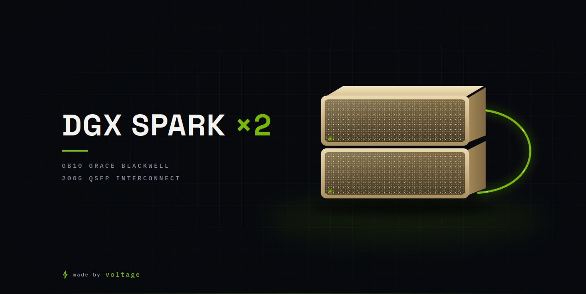
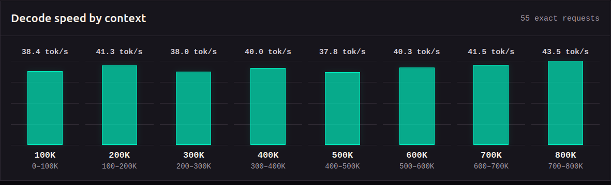

<p align="center">
  
</p>

# DeepSeek V4 Flash Vision on 2x DGX Spark

Reproducible two-node vLLM deployment for
[`deepseek-ai/DeepSeek-V4-Flash-Vision-Exp`](https://huggingface.co/deepseek-ai/DeepSeek-V4-Flash-Vision-Exp)
on two NVIDIA DGX Spark systems.

This is a standalone OpenAI-compatible inference server. It has no dependency
on NYX or any other agent harness.

<p align="center">
  
</p>

## What this configuration provides

- Native DeepSeek image understanding; no sidecar vision model.
- Tensor parallelism across two GB10 systems (`TP=2`) over ConnectX-7/RoCE.
- One interactive sequence with a 1,048,576-token per-request ceiling.
- FP8 KV cache, FP4/FP8 checkpoint weights, expert parallelism, and MTP3.
- Tool-call and reasoning parsers for the DeepSeek V4 wire format.
- Coordinated recovery: a failed rank causes both ranks to stop and restart.
- Pinned vLLM and FlashInfer sources instead of moving development branches.

The current recipe was validated on 2026-09-04. Native Vision support has
merged into vLLM main, but its post-merge loader/DSpark correction and the
required GB10 FlashInfer work are not both in a stable release. This repository
therefore pins every moving artifact and verifies the fixes by behavior.

## Exact tested stack

| Component | Tested value |
| --- | --- |
| Hardware | 2x NVIDIA DGX Spark / GB10 / SM121 |
| Host OS | Ubuntu 24.04.4 LTS, ARM64 |
| NVIDIA driver | 580.173.02 |
| Docker | 29.2.1 |
| Docker Compose | 5.0.2 |
| Model | `deepseek-ai/DeepSeek-V4-Flash-Vision-Exp` |
| Model revision | `e46e16bf6035c6f317eb2ac7458eb0362926d402` |
| Model payload | 48 shards, 167,811,372,792 bytes (~157 GiB on disk) |
| Official vLLM ARM64 image | `vllm/vllm-openai@sha256:8568b4bbc821903d93a0a9c17dd80382fdc0ba78eaa128e3eb5cb71c3bf06b79` |
| Base-image vLLM | `0.28.1rc1.dev137+g5ab628dd1` |
| Serving vLLM | `0.28.1rc1.dev317+g1356635d8` |
| vLLM commit | `1356635d837c4ef002ec98c1a0296e7ff60be3c1` |
| vLLM wheel SHA-256 | `1928aee68356885d7eb696aa0ed226dfa537e00721c9c5376fafddc04490d198` |
| Native Vision work | [vllm#54566](https://github.com/vllm-project/vllm/pull/54566), merged as `1356635` |
| Loader and DSpark fix | [vllm#54631](https://github.com/vllm-project/vllm/pull/54631), pinned at `a5f98b4` |
| PR #54631 patch SHA-256 | `4fecb840fcd985eeada0538202f920e9293d8ecb7ce9c0cb8337ed7703cff4d4` |
| FlashInfer work | [flashinfer#4802](https://github.com/flashinfer-ai/flashinfer/pull/4802) |
| FlashInfer commit | `26fabfe93ab7e866b1a3b581ca6ba2b984d49706` |
| FlashInfer source archive SHA-256 | `e007f4611041cf4015224044fbe4b53a3074561626362accc542093c4757a5ad` |
| Resulting local image tag | `local/deepseek-v4-flash-vision:vllm-1356635-pr54631-fi-26fabfe-gb10` |

The public tag `vllm/vllm-openai:deepseekv4-flash-vision` is multi-platform
and mutable. Its tested ARM64 manifest is the digest above. Do not replace the
digest with the tag unless the new image has been validated separately.

## Architecture

```text
OpenAI client
    |
    | HTTP :8888
    v
Spark A / head / node rank 0
    DeepSeek worker TP0 + API server
    |\
    | +-- RoCE path 0: 10.100.32.1 <-> 10.100.32.2
    | +-- RoCE path 1: 10.100.33.1 <-> 10.100.33.2
    |     one QSFP cable, two logical ConnectX-7 paths, NCCL merged
    v
Spark B / worker / node rank 1
    DeepSeek worker TP1, headless
```

Both nodes need the same model snapshot and the same Docker image. This recipe
uses a local model copy on each node. That consumes more disk but removes NFS
from the model-loading and JIT path.

## Capacity and measured reference

The tested profile produced:

- `max_model_len`: 1,048,576 tokens.
- Shared KV capacity: 1,219,414 tokens / 11.97 GiB.
- Reported full-window concurrency: 1.16x; this recipe still limits active
  sequences to one.
- Seven controlled 256-token runs: 51.8 decode tokens/s median
  (45.3-56.4 tokens/s).
- A natural 1,200-token high-reasoning run: 32.06 decode tokens/s after a
  persistent-cache restart.
- MTP3 accepted 84.0% of controlled draft tokens and 36.5% on the natural
  reasoning workload. Acceptance is workload dependent.
- A fresh 131,072-token prompt completed at 74.47 seconds TTFT after restart;
  the earlier 262,043-token exact beginning/end recall gate also passed.
- Native vision passed 8/8 shifted-cache probes; tool calling passed 7/7.
- Coordinated worker-loss recovery passed.
- Recovery after an intentional worker kill took about 498 seconds.
- Each RoCE path sustained about 109 Gbit/s in `ib_write_bw`; both paths run
  concurrently sustained 196.09 Gbit/s aggregate.
- A two-rank, 8 GiB-per-rank NCCL all-gather sustained a median 22.952 GB/s
  bus bandwidth (183.62 Gbit/s) over five measured iterations.
- Production vLLM traffic increased both RoCE counters almost exactly 50/50
  during a 128,111-token prompt, which recalled both distant markers exactly.
- An identical short-decode probe measured 31.23 tokens/s before and 31.39
  tokens/s after enabling the second path. This change improves bulk
  collectives and transfer-heavy prefill/vision work, not steady decode.

The decode figures are **not** full 1M-occupied-context benchmarks. The server
allowed 1M while those prompts were shorter. Full-window decode speed has not
been measured. The newer runtime matched the previous warmed 131K TTFT within
measurement noise (70.37 versus 70.53 seconds), so no prefill-speed gain is
claimed.

## Before installation

Do these first:

1. Update both Sparks to the same current DGX OS/firmware release.
2. Use the same username, UID, and primary GID on both nodes.
3. Connect the systems with a supported QSFP cable.
4. Configure ConnectX-7 using NVIDIA Sync Cluster Assistant or NVIDIA's
   [ConnectX-7 guide](https://docs.nvidia.com/dgx/dgx-spark/spark-clustering.html).
5. Configure passwordless SSH from the head to the worker.
6. Confirm the user can run Docker without `sudo` on both nodes.
7. Reserve at least 250 GiB of free disk per node; 300 GiB is safer on the
   build node because Docker keeps build cache.
8. Stop other large models before launching this one.

The tested systems had `earlyoom` disabled. DGX Spark uses unified memory, and
an early-OOM daemon can kill a healthy vLLM process while the model and KV cache
are being established.

```bash
sudo systemctl disable --now earlyoom 2>/dev/null || true
```

Install only missing host utilities; use NVIDIA's installed Docker and NVIDIA
Container Toolkit rather than replacing them with unrelated packages.

```bash
sudo apt update
sudo apt install -y git curl jq rsync zstd python3-venv rdma-core ibverbs-utils infiniband-diags
sudo usermod -aG docker "$USER"
```

Log out and back in after changing Docker group membership.

## 1. Verify the cluster fabric

Run on both nodes:

```bash
nvidia-smi
docker version
docker compose version
docker run --rm --gpus all ubuntu:24.04 nvidia-smi
ibdev2netdev
ip -br -4 addr
show_gids
ls -la /dev/infiniband
```

One physical DGX Spark QSFP connection exposes two independent logical paths.
Find both active Ethernet interfaces and their matching RoCE devices. Example
from the tested pair:

```text
RoCE device   Ethernet device   Head IP          Worker IP
rocep1s0f0    enp1s0f0np0      10.100.32.1/24   10.100.32.2/24
roceP2p1s0f0  enP2p1s0f0np0    10.100.33.1/24   10.100.33.2/24
RoCE GID index: 3
Ethernet MTU:   9000 on all four interfaces
```

These names are examples, not universal constants. A cable in the other port
usually produces `...f1...` names. Set the values discovered on the actual
machines.

Configure disjoint subnets and MTU 9000 persistently. Do not use temporary
`ip link set` commands as the final configuration. On the tested pair, the
relevant part of `/etc/netplan/99-nvidia-sync-cluster.yaml` is:

```yaml
network:
  version: 2
  renderer: NetworkManager
  ethernets:
    enp1s0f0np0:
      dhcp4: false
      mtu: 9000
      addresses: [10.100.32.1/24] # use .2 on the worker
    enP2p1s0f0np0:
      dhcp4: false
      mtu: 9000
      addresses: [10.100.33.1/24] # use .2 on the worker
```

Back up the existing file, merge these fields without deleting unrelated
interfaces, validate, and then apply on each node:

```bash
sudo cp -a /etc/netplan/99-nvidia-sync-cluster.yaml \
  /etc/netplan/99-nvidia-sync-cluster.yaml.bak
sudo netplan generate
sudo netplan apply
```

From the head, all of these must work without interaction:

```bash
ping -c 3 10.100.32.2
ping -c 3 10.100.33.2
ping -M do -s 8972 -c 3 10.100.32.2
ping -M do -s 8972 -c 3 10.100.33.2
ssh spark-b hostname
ssh spark-b docker ps
```

After creating `.env.dspark` in the next section, run the included read-only
check on both nodes. Peer addresses must follow `NCCL_IB_HCA` order:

```bash
# Head
ROCE_PEER_IPS=10.100.32.2,10.100.33.2 ./scripts/verify-dual-roce.sh

# Worker
ROCE_PEER_IPS=10.100.32.1,10.100.33.1 ./scripts/verify-dual-roce.sh
```

Run NVIDIA's
[multi-Spark NCCL test](https://build.nvidia.com/spark/nccl/overview) before
debugging vLLM. Run it with `NCCL_DEBUG=INFO` and confirm that its logs name
both RoCE devices. A TCP or jumbo ping proves neither RDMA nor NCCL operation.

## 2. Clone the repository on both nodes

Use the same absolute path on each system when possible.

```bash
git clone https://github.com/madalin-dogaru/DeepSeek-V4-Flash-Vision-2x-DGX-Spark.git
cd DeepSeek-V4-Flash-Vision-2x-DGX-Spark
git checkout master
```

Repeat on the worker. Then verify both nodes report the same commit:

```bash
git rev-parse HEAD
ssh spark-b 'cd ~/DeepSeek-V4-Flash-Vision-2x-DGX-Spark && git rev-parse HEAD'
```

## 3. Configure each node

On both nodes:

```bash
cp .env.dspark.example .env.dspark
chmod 600 .env.dspark
```

Edit `.env.dspark` on the head. At minimum, set:

```env
WORKER_HOST=spark-b
WORKER_SCRIPT_DIR=/home/YOUR_USER/DeepSeek-V4-Flash-Vision-2x-DGX-Spark
MASTER_ADDR=10.100.32.1
VLLM_HOST_IP=10.100.32.1
WORKER_VLLM_HOST_IP=10.100.32.2
NCCL_IB_HCA=rocep1s0f0,roceP2p1s0f0
NCCL_SOCKET_IFNAME=enp1s0f0np0
TP_SOCKET_IFNAME=enp1s0f0np0
GLOO_SOCKET_IFNAME=enp1s0f0np0
NCCL_IB_GID_INDEX=3
NCCL_IB_MERGE_NICS=1
```

`NCCL_SOCKET_IFNAME`, `TP_SOCKET_IFNAME`, and `GLOO_SOCKET_IFNAME` remain on
one interface because they carry bootstrap/control traffic. The comma-separated
`NCCL_IB_HCA` value is what enables both RDMA data paths. `NCCL_IB_MERGE_NICS=1`
allows NCCL to aggregate those paths.

Edit the worker's copy if its interface names or cache path differ. Do not
change these tested serving values for the first boot:

```env
DSPARK_REVISION=e46e16bf6035c6f317eb2ac7458eb0362926d402
OFFICIAL_MAX_MODEL_LEN=1048576
OFFICIAL_GPU_MEMORY_UTILIZATION=0.80
OFFICIAL_MTP_NUM_TOKENS=3
MAX_NUM_BATCHED_TOKENS=8192
LONG_PREFILL_TOKEN_THRESHOLD=1024
OFFICIAL_RUNTIME_CACHE_ROOT=/cache/huggingface/runtime-cache/vllm-1356635-pr54631-sm121
OFFICIAL_ADAPTIVE_VERIFICATION=false
VLLM_ADAPTIVE_VERIFICATION_PROFILE_CONTEXT_LEN=131072
VLLM_USE_BREAKABLE_CUDAGRAPH=1
DSPARK_RESTART_POLICY=no
```

If API authentication is enabled, set the same `VLLM_API_KEY` on both nodes.
Never expose port 8888 directly to the public Internet without authentication
and network controls.

## 4. Download once, then replicate over ConnectX

Download the pinned snapshot on the head node only. The download is resumable:

```bash
python3 -m venv ~/.venvs/huggingface
~/.venvs/huggingface/bin/pip install --upgrade huggingface_hub

export HF_HOME="$HOME/.cache/huggingface"
export HF_HUB_DISABLE_XET=1
~/.venvs/huggingface/bin/hf download \
  deepseek-ai/DeepSeek-V4-Flash-Vision-Exp \
  --revision e46e16bf6035c6f317eb2ac7458eb0362926d402 \
  --cache-dir "$HF_HOME/hub"
```

Verify the head copy before transferring it:

```bash
export HF_HOME="$HOME/.cache/huggingface"
REV=e46e16bf6035c6f317eb2ac7458eb0362926d402
SNAP="$HF_HOME/hub/models--deepseek-ai--DeepSeek-V4-Flash-Vision-Exp/snapshots/$REV"

test -f "$SNAP/model.safetensors.index.json"
test -f "$SNAP/model-00048-of-00048.safetensors"
test "$(find "$SNAP" -maxdepth 1 -name 'model-*.safetensors' | wc -l)" -eq 48
test -z "$(find -L "$SNAP" -type l -print -quit)"
test -z "$(find "$HF_HOME/hub/models--deepseek-ai--DeepSeek-V4-Flash-Vision-Exp" -name '*.incomplete' -print -quit)"
du -sh "$HF_HOME/hub/models--deepseek-ai--DeepSeek-V4-Flash-Vision-Exp"
```

Expected size is approximately `157G`. Do not continue with missing shards or
`.incomplete` files.

Transfer the complete repository cache to the worker over ConnectX-7. `WORKER`
must resolve to the worker's ConnectX address, not its management interface.
The same absolute `HF_HOME` path is assumed on both nodes:

```bash
export HF_HOME="$HOME/.cache/huggingface"
WORKER=spark-b
MODEL_CACHE="$HF_HOME/hub/models--deepseek-ai--DeepSeek-V4-Flash-Vision-Exp"

# Confirm that SSH itself is using the ConnectX path.
ssh "$WORKER" 'hostname; echo "$SSH_CONNECTION"'

ssh "$WORKER" "mkdir -p '$MODEL_CACHE'"
rsync -aH --whole-file --partial --info=progress2 \
  "$MODEL_CACHE/" \
  "$WORKER:$MODEL_CACHE/"
```

Do not add compression: safetensors are effectively incompressible and
compression wastes CPU. Copy the entire `models--...` directory rather than
only `snapshots/$REV`; snapshot entries link to files under `blobs/`. Rerun the
same `rsync` command after an interruption and it will safely complete the
destination.

Run the same verification on the worker:

```bash
export HF_HOME="$HOME/.cache/huggingface"
WORKER=spark-b
REV=e46e16bf6035c6f317eb2ac7458eb0362926d402

ssh "$WORKER" \
  "HF_HOME='$HF_HOME' REV='$REV' bash -s" <<'VERIFY'
set -euo pipefail
SNAP="$HF_HOME/hub/models--deepseek-ai--DeepSeek-V4-Flash-Vision-Exp/snapshots/$REV"
test -f "$SNAP/model.safetensors.index.json"
test -f "$SNAP/model-00048-of-00048.safetensors"
test "$(find "$SNAP" -maxdepth 1 -name 'model-*.safetensors' | wc -l)" -eq 48
test -z "$(find -L "$SNAP" -type l -print -quit)"
test -z "$(find "$HF_HOME/hub/models--deepseek-ai--DeepSeek-V4-Flash-Vision-Exp" -name '*.incomplete' -print -quit)"
du -sh "$HF_HOME/hub/models--deepseek-ai--DeepSeek-V4-Flash-Vision-Exp"
VERIFY
```

Both nodes still serve from local NVMe; ConnectX is used only for replication.
Keep `HF_HUB_OFFLINE=1` in `.env.dspark` after the copy so production boot does
not depend on Hugging Face availability or a moving upstream state.

## 5. Build the pinned runtime and copy it to the worker

Run from the repository on the head:

```bash
./build-official-vision-runtime.sh --sync-worker
```

The build does six important things:

1. Uses the official vLLM Vision ARM64 image by immutable manifest digest.
2. Downloads FlashInfer pull request #4802 at the pinned commit and verifies
   its archive SHA-256.
3. Replaces the complete FlashInfer Python/CUDA/header source surface.
4. Removes the stock sparse-MLA AOT binary so the corrected SM121 source is
   JIT-compiled instead of being silently shadowed.
5. Installs the checksum-pinned vLLM wheel containing merged native Vision
   support, then applies the checksum-pinned PR #54631 loader/DSpark fix.
6. Runs behavior checks for streamed weight loading and trained DSpark width,
   not just version or label checks.

The script verifies vLLM and FlashInfer contents, then streams the resulting
image to the worker over the cluster interface. It uses `zstd` when available
and rejects the transfer unless both nodes report the same image ID.

Verify both image IDs match:

```bash
IMAGE=local/deepseek-v4-flash-vision:vllm-1356635-pr54631-fi-26fabfe-gb10
docker image inspect "$IMAGE" --format '{{.Id}}'
ssh spark-b "docker image inspect '$IMAGE' --format '{{.Id}}'"
```

## 6. Validate the launch profile

```bash
./scripts/test-official-vision-profile.sh
./scripts/test-supervisor-shutdown.sh
./scripts/test-worker-startup-guard.sh
ROCE_PEER_IPS=10.100.32.2,10.100.33.2 ./scripts/verify-dual-roce.sh
```

The first check renders both node commands and rejects a legacy Vision hotfix,
wrong MTP, wrong context, or FlashInfer-autotune configuration.
The second checks that stopping the supervisor terminates a startup process
group and performs coordinated cleanup. The third verifies that startup waits
for working SSH and Docker and cannot misread a failed remote query as an empty
worker. The fourth proves that both configured RoCE paths are active at MTU
9000 and carry a full 8972-byte ping payload.

## 7. First launch

Ensure `.env.dspark`, the repository, model snapshot, and image exist on the
worker. Then run on the head:

```bash
./start-official-vision-runtime.sh
```

The worker starts first in headless mode, followed by the head/API rank. The
launcher waits up to 30 minutes for health.

Monitor both ranks in separate terminals:

```bash
docker logs -f deepseek-v4-flash-vllm-dspark-1
ssh spark-b 'docker logs -f deepseek-v4-flash-vllm-dspark-1'
```

Do not assume the first FlashInfer JIT is a hang. Wait while both ranks are
alive and logs continue to advance. A warm recovery on the tested pair took
about eight minutes. Initial compilation can take longer.

Healthy output should include values close to:

```text
Available KV cache memory: 11.97 GiB
GPU KV cache size: 1,219,414 tokens
Maximum concurrency for 1,048,576 tokens per request: 1.16x
```

Check the API:

```bash
curl -fsS http://127.0.0.1:8888/health
curl -fsS http://127.0.0.1:8888/v1/models | jq
```

The model response must contain:

```text
id: deepseek-v4-flash-vision-exp
max_model_len: 1048576
```

## 8. Acceptance tests

### Text

```bash
curl -fsS http://127.0.0.1:8888/v1/chat/completions \
  -H 'Content-Type: application/json' \
  -d '{
    "model":"deepseek-v4-flash-vision-exp",
    "messages":[{"role":"user","content":"Return only the integer result of 17*19."}],
    "temperature":0,
    "max_tokens":64,
    "chat_template_kwargs":{"thinking":false}
  }' | jq
```

Expected visible answer: `323`.

### Native vision and cache alignment

```bash
python3 scripts/live-vision-cache-regression.py \
  --base-url http://127.0.0.1:8888 \
  --model deepseek-v4-flash-vision-exp
```

This generates a red PNG in memory and reuses identical bytes at eight prompt
offsets. Every response must recognize red and `/health` must remain available.
It specifically catches the position-dependent image-compressor cache failure
that can otherwise kill the engine.

For real images, send standard OpenAI multipart content with the image on a
`user` message:

```json
{
  "model": "deepseek-v4-flash-vision-exp",
  "messages": [{
    "role": "user",
    "content": [
      {"type": "image_url", "image_url": {"url": "data:image/png;base64,..."}},
      {"type": "text", "text": "Describe this image precisely."}
    ]
  }],
  "max_tokens": 1024
}
```

Base64 and HTTP(S) URLs work without filesystem access. `file://` URLs require
an explicit `--allowed-local-media-path` and a matching container mount; they
are intentionally not enabled by this recipe. Video is not supported by the
checkpoint. The profile caps input at eight images per request.

### Tool calling

```bash
curl -fsS http://127.0.0.1:8888/v1/chat/completions \
  -H 'Content-Type: application/json' \
  -d '{
    "model":"deepseek-v4-flash-vision-exp",
    "messages":[{"role":"user","content":"Call multiply with a=17 and b=19. Do not answer directly."}],
    "tools":[{"type":"function","function":{"name":"multiply","description":"Multiply two integers","parameters":{"type":"object","properties":{"a":{"type":"integer"},"b":{"type":"integer"}},"required":["a","b"],"additionalProperties":false}}}],
    "tool_choice":"required",
    "temperature":0,
    "max_tokens":256,
    "chat_template_kwargs":{"thinking":false}
  }' | jq '.choices[0].message.tool_calls'
```

The result must contain one `multiply` call with valid JSON arguments.

### MTP metrics

```bash
curl -fsS http://127.0.0.1:8888/metrics \
  | grep -E 'vllm:spec_decode_num_(draft|accepted)_tokens_total'
```

Accepted tokens should increase after generation. Do not compare a tiny smoke
request directly with a long benchmark; acceptance depends on the workload.

## 9. Install coordinated systemd recovery

First stop a manually started pair:

```bash
./stop-official-vision-runtime.sh
```

Generate the service from the template on the head:

```bash
INSTALL_DIR="$(pwd)"
USER_NAME="$(id -un)"
GROUP_NAME="$(id -gn)"

sed \
  -e "s|@USER@|$USER_NAME|g" \
  -e "s|@GROUP@|$GROUP_NAME|g" \
  -e "s|@INSTALL_DIR@|$INSTALL_DIR|g" \
  systemd/deepseek-v4-vision.service.template \
  | sudo tee /etc/systemd/system/deepseek-v4-vision.service >/dev/null

sudo systemctl daemon-reload
sudo systemctl enable --now deepseek-v4-vision.service
```

Follow startup and inspect status:

```bash
sudo journalctl -fu deepseek-v4-vision.service
sudo systemctl show deepseek-v4-vision.service \
  -p ActiveState -p SubState -p MainPID -p NRestarts
```

The supervisor checks the head container, worker container, and API every ten
seconds. Six consecutive failures trigger this sequence:

1. Save bounded head/worker state and logs under `logs/incidents/`.
2. Stop both tensor-parallel ranks.
3. Exit nonzero.
4. Let systemd wait 60 seconds and restart the complete pair.

Docker's restart policy must stay `no`. Restarting only one TP rank can leave
the other rank blocked in a collective and makes failure diagnosis unreliable.

## Daily operations

```bash
# Health
curl -fsS http://127.0.0.1:8888/health
curl -fsS http://127.0.0.1:8888/v1/models | jq

# Logs
sudo journalctl -u deepseek-v4-vision.service -n 200 --no-pager
docker logs --tail 200 deepseek-v4-flash-vllm-dspark-1
ssh spark-b 'docker logs --tail 200 deepseek-v4-flash-vllm-dspark-1'

# Coordinated restart
sudo systemctl restart deepseek-v4-vision.service

# Coordinated stop
sudo systemctl stop deepseek-v4-vision.service
```

The normal OpenAI client configuration is:

```text
base_url = http://HEAD_NODE_IP:8888/v1
model    = deepseek-v4-flash-vision-exp
api_key  = the configured VLLM_API_KEY, or any placeholder if auth is disabled
```

## Optional Spark Studio visibility

[Spark Studio](https://github.com/TheAwaken1/Spark-Studio) can display and use
an endpoint that this repository already manages. This is registration only:
Spark Studio does not launch the model, own its containers, replace the
coordinated supervisor, or change anything for existing API clients.

When Spark Studio and vLLM run on the same head node:

```bash
./scripts/register-spark-studio.sh
```

When either service is elsewhere, provide URLs that are reachable from the
Spark Studio host:

```bash
./scripts/register-spark-studio.sh \
  --studio-url http://SPARK_STUDIO_HOST:7860 \
  --endpoint-url http://HEAD_NODE_IP:8888
```

The helper verifies both services, checks the OpenAI-compatible `/v1/models`
response, and avoids duplicate live registrations. Passing an endpoint ending
in `/v1` is accepted and normalized automatically.

The registered model is available to Spark Studio chat, benchmarks, health
monitoring, and agent targeting. Spark Studio cannot provide native container
logs, model load timing, or managed start/stop for an externally owned runtime;
use this repository's systemd and log commands for those operations.

Spark Studio's current external-endpoint contract has no API-key field and its
registration probe is unauthenticated. Consequently, this integration requires
`/v1/models` to be reachable without an API key. The helper fails clearly
instead of registering a configuration Spark Studio cannot use. Do not expose
an unauthenticated endpoint beyond a trusted host or network.

You can also register it manually in Spark Studio under the vLLM page's
**Connect existing endpoint** panel. The API payload shape is `engine`, `name`,
and `url`; `base_url` is not accepted by that registration endpoint.

## Known traps and the fixes in this repository

| Symptom | Cause | Correct action |
| --- | --- | --- |
| Stable vLLM fails on hundreds of vision tensors | The installed release predates native Vision support | Use the pinned wheel and patch built by this repository |
| Model load exhausts host memory | The merged Vision loader sorts and retains the mapped checkpoint before TP sharding | Keep the pinned PR #54631 streaming-loader patch |
| DSpark uses the wrong proposal width | Generic MTP layer count was used instead of the checkpoint's trained `dspark_block_size` | Keep PR #54631 and MTP3; the image verifier tests the internal width |
| Sparse-MLA hangs or crashes on GB10 | Stock FlashInfer surface/AOT binary does not contain the required tested SM121 path | Build the repository overlay; do not merely copy one Python file |
| Crash during FlashInfer crossover tuning | GB10 row-strided metadata can be routed into a dense-row prefill path | Keep `--no-enable-flashinfer-autotune` and the isolated workspace |
| Machines become difficult to SSH into during load | DGX Spark unified memory is overcommitted | Keep utilization at `0.80`, stop other models, disable earlyoom |
| One container restarts while the other waits forever | Tensor-parallel ranks were managed independently | Use `restart: no` and the coordinated supervisor |
| Head boots before the worker is reachable | Startup queried stale-container state through a failed SSH connection | Use the current launcher, which waits for SSH plus Docker and rejects failed remote state queries |
| NCCL uses only about half the expected link bandwidth | Only one of the QSFP port's two logical RoCE devices is configured, or MTU remains 1500 | Configure both subnets at MTU 9000, list both devices in `NCCL_IB_HCA`, and run `verify-dual-roce.sh` |
| First boot appears frozen | 48 model shards plus FlashInfer/Triton JIT compilation | Watch both logs and wait while both containers remain alive |
| Every restart repeats avoidable compiler work | Triton, TileLang, or TorchInductor caches are not host-persistent or share an incompatible namespace | Keep the versioned `OFFICIAL_RUNTIME_CACHE_ROOT` on the mounted cache |
| Adaptive DSpark verification fails on GB10 | The current DeepSeek V4 indexer cannot handle the required device/CPU length mismatch | Keep `OFFICIAL_ADAPTIVE_VERIFICATION=false`; the verifier rejects unsupported use |
| Fresh offline boot reports `LocalEntryNotFoundError` despite a complete pinned snapshot | An older recipe did not propagate the pinned revision to the container and MTP loader | Update the recipe; do not fabricate `refs/main` or disable offline mode |
| Short answer is empty or ends at the token limit | Reasoning consumed `max_tokens` | Raise `max_tokens` or request lower/off reasoning |
| Local image path is rejected | No host path was granted to vLLM | Use base64/HTTP, or deliberately add a read-only mount and `--allowed-local-media-path` |
| A tool-enabled client gets malformed continuation | Client replayed a truncated tool call | Honor `finish_reason`; never replay incomplete tool arguments |
| `51 tok/s at 1M` is assumed | Context ceiling was confused with occupied context | Benchmark at the actual prompt length you care about |

## Why these non-default choices matter

- **MTP3:** it is the measured single-session winner. MTP5 was 12.4% slower on
  controlled decode and 12.7% slower on a natural high-reasoning workload
  because its fourth and fifth draft positions were rarely accepted.
- **Adaptive verification off:** this is the exact GB10 configuration validated
  here. The official GB200 example enables it, but that is a different hardware
  and kernel path.
- **FlashInfer autotune off:** this avoids a verified GB10 crossover-routing
  failure. Skipping only the FP4 MoE tuning op is not equivalent.
- **Breakable CUDA graphs on:** this is the supported graph path in the pinned
  vLLM build. Generic capture sizes remain 1, 2, and 4; they are batch shapes,
  not MTP depth.
- **Versioned compiler caches:** they reduce repeated startup work without
  reusing generated binaries across incompatible runtime versions.
- **One sequence:** this deployment is optimized for one interactive agent,
  not aggregate multi-user throughput.
- **FP8 KV:** this leaves enough KV capacity for the 1M ceiling while preserving
  the tested decode path.
- **Local weights on both nodes:** more disk use, fewer network and mount failure
  modes during startup.
- **Two merged RoCE paths:** one QSFP cable exposes two logical devices on DGX
  Spark. Listing both HCAs and using MTU 9000 avoids leaving roughly half of the
  tested inter-node bandwidth idle.

## Updating safely

As of 2026-09-03:

- vLLM Vision pull request #54566 was merged as commit `1356635`.
- Post-merge loader and DSpark pull request #54631 was open at `a5f98b4`.
- FlashInfer pull request #4802 was open.
- The public ARM64 image remains the digest-pinned base. This recipe installs
  the pinned post-merge wheel and patch as explicit, independently verified
  layers.

Do not update the model revision, vLLM base, and FlashInfer overlay together.
Create a new image tag and validate one layer at a time:

1. Verify image package versions and required FlashInfer files.
2. Boot both ranks at the intended 1M ceiling.
3. Run text, native-vision cache, tool-call, and long-context tests.
4. Run at least five sustained decode samples and inspect MTP metrics.
5. Kill the worker container once and prove coordinated recovery.
6. Only then replace the production image tag.

When PR #54631 and the FlashInfer work land in a stable release, prefer the
stable image only after it passes the same gates. Until then, the pins in this
repository are the known-good rollback point.

## Upstream references

- [DeepSeek model card](https://huggingface.co/deepseek-ai/DeepSeek-V4-Flash-Vision-Exp)
- [Official vLLM model recipe](https://recipes.vllm.ai/deepseek-ai/DeepSeek-V4-Flash-Vision-Exp)
- [vLLM native vision PR #54566](https://github.com/vllm-project/vllm/pull/54566)
- [vLLM streaming loader and DSpark fix #54631](https://github.com/vllm-project/vllm/pull/54631)
- [FlashInfer SM120/SM121 sparse-MLA PR #4802](https://github.com/flashinfer-ai/flashinfer/pull/4802)
- [NVIDIA ConnectX-7 clustering guide](https://docs.nvidia.com/dgx/dgx-spark/spark-clustering.html)
- [NVIDIA multi-Spark NCCL validation](https://build.nvidia.com/spark/nccl/overview)
- [MiaAI-Lab two-Spark work](https://github.com/MiaAI-Lab/DeepSeek-v4-Flash-DSpark-2x-DGX-Spark)
- [TonyD2Wild Vision-Exp two-Spark work](https://github.com/tonyd2wild/DeepSeek-v4-Flash-Vision-Exp-DSpark-1M-NVFP4-KV-2x-DGX-Spark)
